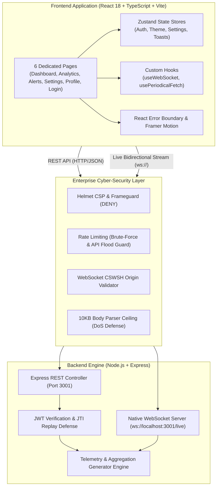

# Multi-Modal Real-Time Dashboard Web App
### Smart Warehouse Sensor Monitoring & Automated Telemetry System (Full-Stack Assessment)

[](.github/workflows/ci.yml)
[](.github/workflows/security.yml)
[](https://www.typescriptlang.org/)
[](https://react.dev/)
[](https://nodejs.org/)
[](https://expressjs.com/)
[](https://github.com/websockets/ws)
[](https://github.com/pmndrs/zustand)
[](LICENSE)

---

## 📋 Table of Contents

- [Project Overview](#-project-overview)
- [System Architecture](#️-system-architecture)
- [Key Features & Assessment Compliance](#-key-features--assessment-compliance)
- [Multi-Modal Interactivity Matrix](#-multi-modal-interactivity-matrix)
- [6-Page Application Structure](#-6-page-application-structure)
- [Enterprise Cyber-Security & OWASP Defenses](#-enterprise-cyber-security--owasp-defenses)
- [REST API & WebSocket Specifications](#-rest-api--websocket-specifications)
- [Quick Start Guide](#-quick-start-guide)
- [Automated Verification & Testing](#-automated-verification--testing)
- [GitHub Workflow & CI/CD](#-github-workflow--cicd)
- [License & Contributions](#-license--contributions)

---

## 🎯 Project Overview

The **Multi-Modal Real-Time Dashboard Web App** is a production-style, enterprise-grade monitoring system engineered for automated smart warehouses, fulfillment sortation facilities, and cold chain distribution hubs.

Built to address the comprehensive **Full-Stack Real-Time Dashboard Assessment**, the application demonstrates:
- **Sub-Second Real-Time Telemetry Streaming** via native WebSockets with interactive broadcast controls (pause, resume, and dynamic cadence).
- **Periodic API Polling & Aggregation** delivering 10-minute derived metrics, trend indicators (↑/↓), and facility zone breakdowns.
- **Enterprise Cyber-Security Defenses** protecting against OWASP Top 10, Brute-Force, Denial of Service (DoS), and Cross-Site WebSocket Hijacking (CSWSH).
- **Unified Theming & Accessibility** supporting dark and light modes with WCAG AA compliance.
- **Robust Session & JWT State Management** with protected routes and auto-logout on expiration.
- **6 Distinct Application Pages** featuring smooth Framer Motion transitions and responsive layouts.

---

## 🏛️ System Architecture



---

## 📊 Key Features & Assessment Compliance

| Requirement | Requirement Specification | NexusFlow Implementation |
|---|---|---|
| **1. Real-Time Ingestion** | Live stream in UI, ≥3 metrics fluctuating, pulsating LIVE badge, timestamp, no reload | 6 live metrics via WebSocket (`ws://localhost:3001/live`), pulsing LIVE dot badge, sub-second waveform charts, and pause/resume stream controls |
| **2. Periodic Polling** | Polling every 5–15s, "Last updated" timestamp, derived/aggregated data | Dedicated `/analytics` polling every 10s (`GET /api/dashboard/summary`), 10-min running averages, today's package throughput, and multi-zone status |
| **3. Theming & Design** | Consistent palette, light/dark mode, WCAG AA contrast across all pages | Defined CSS design tokens (`theme.css`), instant theme switcher, persistent in `localStorage`, consistent across all 6 pages |
| **4. Session Management** | Login flow, route protection, token validation, safe 401 handling | Protected routes via `ProtectedRoute.tsx`, JWT authentication (`/api/auth/login`, `/validate`), auto-logout on expiration, demo credentials helper |
| **5. Multi-Page Routing** | 5–6 distinct pages with seamless routing | 6 distinct pages: `/login`, `/dashboard`, `/analytics`, `/alerts`, `/settings`, `/profile` |
| **6. Domain Coherence** | Coherent domain across labels, metrics, charts, APIs | Smart Warehouse Sensor Monitoring (Ambient Temp °C, Cold Chain Vault °C, Conveyor Load kg, Package Throughput pk/min, AGV Battery %) |
| **7. Multi-Modality** | At least 2 interaction types (visual, form, controls, modals) | 6 interaction types: real-time search, column sorting, severity filters, pause/resume toggle, Framer Motion detail modals, and toast notifications |

---

## ⚡ Multi-Modal Interactivity Matrix

```
┌─────────────────────────┬──────────────────────────────────────────────────────────────┐
│ Interaction Type        │ Implementation Details                                       │
├─────────────────────────┼──────────────────────────────────────────────────────────────┤
│ 1. Real-Time Controls   │ Live stream Pause/Resume button + Cadence Selector (500ms/1s)│
│ 2. Form Search & Filter │ Real-time text search + Severity multi-select (CRITICAL/WARN)│
│ 3. Table Column Sorting │ Dynamic column header sorting (Ascending / Descending)       │
│ 4. Modal Inspection     │ Click any metric card or alert row to open detail modal      │
│ 5. Notification Stack   │ Global dismissible toast stack for action confirmations      │
│ 6. Preference Sliders   │ Interactive threshold sliders and polling frequency toggles  │
└─────────────────────────┴──────────────────────────────────────────────────────────────┘
```

---

## 📄 6-Page Application Structure

1. **[`/login`](frontend/src/pages/LoginPage.tsx)** — Branded login screen with credential validation, error banners, and demo credentials helper.
2. **[`/dashboard`](frontend/src/pages/DashboardPage.tsx)** — Real-time telemetry overview with 6 live metrics, pulsing LIVE badge, waveform charts, event logs, and pause/resume controls.
3. **[`/analytics`](frontend/src/pages/AnalyticsPage.tsx)** — Aggregated trends from periodic polling (every 10s), time window toggles (1h/24h/7d), area/line charts, and sorting zone tables.
4. **[`/alerts`](frontend/src/pages/AlertsPage.tsx)** — Searchable, filterable, and sortable event management table with click-to-open Framer Motion inspection modals.
5. **[`/settings`](frontend/src/pages/SettingsPage.tsx)** — Instant dark/light mode toggle, WebSocket broadcasting frequency slider, and safety threshold boundaries.
6. **[`/profile`](frontend/src/pages/ProfilePage.tsx)** — Active operator profile, JWT token verification metadata, operational audit history, and sign-out action.

---

## 🛡️ Enterprise Cyber-Security & OWASP Defenses

The system implements multi-layered security controls to protect against common web vulnerabilities:

1. **OWASP Top 10 Defenses (Helmet)**:
   - Strict `Content-Security-Policy` (CSP) preventing script injection.
   - `X-Frame-Options: DENY` preventing Clickjacking.
   - `X-Content-Type-Options: nosniff` preventing MIME confusion attacks.
   - `Strict-Transport-Security` (HSTS) with 1-year preloading.
2. **DDoS & Rate-Limiting Protection (`express-rate-limit`)**:
   - Strict brute-force limiter on `/api/auth/login` (20 attempts / 15 mins).
   - General API limiter (1,000 req / 15 mins) preventing flood attacks while accommodating real-time telemetry polling.
3. **Denial of Service (DoS) Payload Limiting**:
   - Strict `10kb` body parser limit rejecting oversized payloads (`413 Payload Too Large`).
4. **Cross-Site WebSocket Hijacking (CSWSH) Defense**:
   - WebSocket upgrade handshake verifies request `Origin` against an authorized whitelist; unauthorized origins are terminated with `403 Forbidden`.
   - Capped 4KB frame size and client control flood rate limits.
5. **Cryptographic Hardening & Timing Defense**:
   - Salted `bcryptjs` password hashing (10 rounds).
   - Side-channel timing attack defenses with dummy comparisons.
   - Hardened JWT with `algorithm: 'HS256'`, unique cryptographic `jti` claim, and issuer/audience verification.
6. **Defensive Client Engineering**:
   - React `ErrorBoundary` isolating UI faults and shielding stack traces.
   - Polling hooks with stable reference management preventing infinite re-fetch loops.

---

## 📡 REST API & WebSocket Specifications

### Public Endpoints
- `GET /` — Friendly server console landing page with direct dashboard launch link.
- `GET /api/health` — System health and security state check.
- `POST /api/auth/login` — Authenticate operator credentials. Returns JWT token and user profile.
- `POST /api/auth/logout` — Invalidate user session.

### Protected Endpoints (`Authorization: Bearer <token>`)
- `GET /api/auth/validate` — Validate session token integrity and retrieve operator profile.
- `GET /api/dashboard/summary` — Derived 10-minute running averages, total processed packages, and zone metrics.
- `GET /api/dashboard/alerts?severity=CRITICAL&search=cold` — Searchable and filterable alert records.
- `GET /api/dashboard/history?range=1h|24h|7d` — Historical time-series telemetry points for charting.

### WebSocket Live Stream
- Endpoint: `ws://localhost:3001/live`
- Streaming Cadence: Every 500ms – 2000ms (Client adjustable)
- Telemetry Payload:
  ```json
  {
    "timestamp": "2026-09-08T11:15:20.100Z",
    "metrics": {
      "ambientTemperature": 22.4,
      "coldStorageTemperature": -18.2,
      "humidity": 48.5,
      "conveyorLoad": 412.0,
      "packageThroughput": 64,
      "agvBattery": 88,
      "totalProcessed": 14280
    },
    "status": "NOMINAL",
    "event": "TELEMETRY_SAMPLE",
    "facility": "Zone B - East Sorting Facility"
  }
  ```
- Client Actions:
  - `{ "action": "pause" }` — Suspend streaming.
  - `{ "action": "resume" }` — Resume streaming.
  - `{ "action": "speed", "interval": 500 }` — Adjust broadcast frequency.

---

## 🚀 Quick Start Guide

### Prerequisites
- **Node.js**: v18.0+ (Tested on v24.13.0)
- **npm**: v9.0+

### Step 1: Install Dependencies
```bash
npm run install:all
```

### Step 2: Run Development Servers
In **Terminal 1** (Backend API & WebSocket Server):
```bash
npm run backend
```
> Server runs at `http://localhost:3001` (WebSocket at `ws://localhost:3001/live`).

In **Terminal 2** (Frontend React Application):
```bash
npm run frontend
```
> Application opens at `http://localhost:5173`.

### Demo Credentials
- **Username**: `admin`
- **Password**: `password`

---

## 🧪 Automated Verification & Testing

Execute the automated test suites to verify system functionality and security posture:

```bash
# 1. Full System End-to-End Verification
npm run test:system

# 2. Cyber-Security & Attack Defense Suite
node verify-security.js

# 3. Production Frontend Typecheck & Build
npm run build
```

---

## 🔄 GitHub Workflow & CI/CD

This repository includes a comprehensive GitHub enterprise workflow:

- **`.github/workflows/ci.yml`**: Automated pipeline running on every push and pull request across Node 18, 20, and 22 matrices. Builds frontend, launches backend, and executes security and functional test suites.
- **`.github/workflows/security.yml`**: Static security analysis using GitHub CodeQL and dependency vulnerability auditing.
- **`.github/PULL_REQUEST_TEMPLATE.md`**: Standardized PR template with verification checklist.
- **`.github/ISSUE_TEMPLATE/`**: Standard issue templates for Bug Reports and Feature Requests.
- **`CONTRIBUTING.md`**: Contributor guidelines, branching strategies, and testing requirements.
- **`CODE_OF_CONDUCT.md`**: Community standards based on Contributor Covenant.
- **`SECURITY.md`**: Security disclosure and vulnerability response policy.

---

## 📜 License

This project is licensed under the **MIT License** — see the [LICENSE](LICENSE) file for details.
